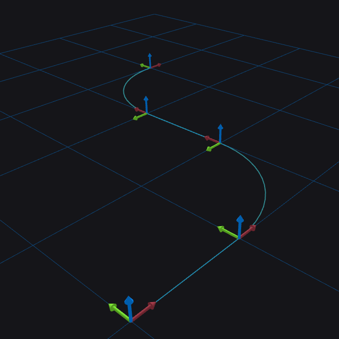
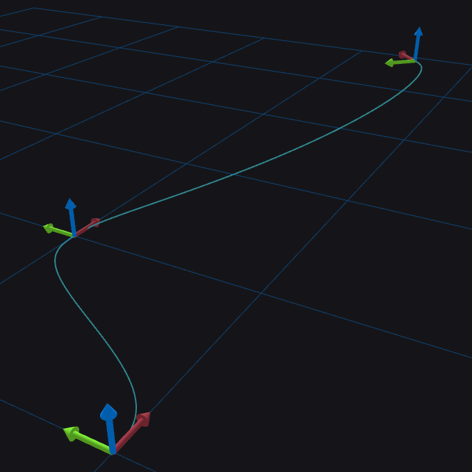

# Curves

Curves are functions from a single real scalar variable (such as time) to
another manifold (such as 3D space or a [Lie
group](../transforms/liegroups.md)). Consequently, they end up being very
useful for representing the trajectory of a rigid body over time (among other
things), so we provide two primary classes to represent curves through Lie
groups:

 - **DCurve**: This class represents an arc-length-parameterized curve through
   `SE3`. It gives an `SE3` object as a function of the distance travelled
   along the curve.
 - **TCurve**: This class gives a twice continuously differentiable
   time-parameterized curve built up from a sequence of quintic Hermite spline
   segments.

Each of these has its own peculiarities and uses which we will outline in
detail.

## DCurve

A `DCurve` is a sequence of geodesic segments that interpolate between a vector
of `SE3` objects passed to its constructor. More precisely we can make a
piecewise geodesic curve connecting the frames described by each `SE3` object
we passed in order. We can query the curve as a function of the arc length
along it using the `DCurve::point_at()` function. As the arc length increases
from zero, the curve will move through each of the `SE3`s we passed into the
constructor creating a continuous curve. `DCurve`s are useful whenever one has
a set of points with headings (or full orientations) and they want to produce a
reasonable continuous geometry connecting them. This could be the case if a
user wants to represent static geometry, such as the center-line of a road, or
a boundary around an area. However, one should note that the derivatives of the
motion along a `DCurve` are not continuous when switching from one segment to
the next. Furthermore, they do not work well if they have zero-length segments.
Here's an example of how to construct and use a `DCurve`:

```
#include "resim/assert/assert.hh"
#include "resim/curves/d_curve.hh" 
#include "resim/transforms/se3.hh"
#include "resim/transforms/so3.hh"
#include "resim/visualization/view.hh"

// ...

using resim::transforms::SE3;
using resim::transforms::SO3;
using Frame = resim::transforms::Frame<3>;

const Frame world_frame{Frame::new_frame()};
VIEW(world_frame) << "World frame";
const Frame d_curve_frame{Frame::new_frame()};
VIEW(d_curve_frame) << "DCurve";

// Make a DCurve that goes straight for one unit, turns left along a unit
// circle for pi/2 radians, continues straight in the y direction for one
// unit, and then turns to the right back to its original heading along a unit
// circle.
const resim::curves::DCurve<SE3> d_curve{
    SE3::identity(world_frame, d_curve_frame),
    SE3{{1., 0., 0.}, world_frame, d_curve_frame},
    SE3{SO3{M_PI_2, {0., 0., 1.}}, {2., 1., 0.}, world_frame, d_curve_frame},
    SE3{SO3{M_PI_2, {0., 0., 1.}}, {2., 2., 0.}, world_frame, d_curve_frame},
    SE3{{3., 3., 0.}, world_frame, d_curve_frame},
};

// Query a point halfway along the third edge:
const double QUERY_ARC_LENTH = 1.0 + M_PI_2 + 0.5;
const SE3 reference_from_queried{d_curve.point_at(QUERY_ARC_LENTH)};

REASSERT(
    reference_from_queried.rotation().is_approx(SO3{M_PI_2, {0., 0., 1.}}));
REASSERT(reference_from_queried.translation().isApprox(
    Eigen::Vector3d{2., 1.5, 0.}));

VIEW(d_curve) << "My DCurve";

```

This produces a curve that looks like this:



## Two Jet

Before we address `TCurve` objects, we need to discuss the `TwoJet` object.
Briefly, a `TwoJet` is a struct containing a Lie group element along with its
first and second derivatives. There are two varieties of `TwoJet`, namely
`TwoJetR` and `TwoJetL`. The distinction between them is that `TwoJetR`
represents its first and second derivatives as *right tangent vectors*
(described fully in [Using SO(3) and
SE(3)](/resim/transforms/using_liegroups) and [Lie Group
Derivatives](/resim/transforms/liegroup_derivatives)), whereas `TwoJetL`
uses *left tangent vectors*. For simplicity, we'll use the
`actor::state::RigidBodyState` abstraction in our example to make defining
these easy. That way, we can write clearer code that doesn't require us reason
about tangent vectors.

## TCurve

A `TCurve` represents a time-based trajectory using a sequence of quintic
[Hermite splines](https://en.wikipedia.org/wiki/Hermite_interpolation) on the
group $\text{SE(3)}$ (or $\text{SO(3)}$). The details of this operation are
outlined [here](https://ethaneade.com/lie_spline.pdf), but the main take-away
is that this creates a curve through $\text{SE(3)}$ which is twice continuously
differentiable ($\text{C}^2$) as it proceeds through a set of user-provided
control points. All we need to create a `TCurve` is a sequence of control
points which each have a time along with a `TwoJetL` that describes the desired
pose and derivatives at that time. One major use of `TCurve`s is to replay
observed actor trajectories in a simulation. One simply has to take the
observed states of the actors from an autonomy log and convert them into
control points from which they can make a `TCurve`. Then, the simulation just
has to query this `TCurve` over time to replay the trajectory. Usually, it is
recommended to use the `actor::state::Trajectory` class, which is a
higher-level wrapper for `TCurve` in such cases. Note that the control points
must be monotonically increasing in time for the curve to be valid. Here's an
example of how we can create one:

```
#include "resim/actor/state/rigid_body_state.hh"
#include "resim/assert/assert.hh"
#include "resim/curves/t_curve.hh"
#include "resim/transforms/frame.hh"
#include "resim/transforms/se3.hh"
#include "resim/transforms/so3.hh"
#include "resim/visualization/view.hh"

// ...

using resim::transforms::SE3;
using resim::transforms::SO3;
using RigidBodyState = resim::actor::state::RigidBodyState<SE3>;
using TCurve = resim::curves::TCurve<SE3>;
using Frame = resim::transforms::Frame<3>;

const Frame t_curve_frame{Frame::new_frame()};
VIEW(t_curve_frame) << "TCurve";

// Define some states that we want to pass through
// A state at the origin with a small forward velocity
RigidBodyState state_a{SE3::identity(world_frame, t_curve_frame)};
state_a.set_body_linear_velocity_mps({0.1, 0., 0.});

// A state at (1, 1, 0) oriented along the x axis with a small forward
// velocity and a small angular velocity about the x axis.
RigidBodyState state_b{SE3{{1., 1., 0.}, world_frame, t_curve_frame}};
state_b.set_body_linear_velocity_mps({0.1, 0., 0.});
state_b.set_body_angular_velocity_radps({0.1, 0., 0.});

// A state at (3, 0, 0.5) with a rotation of pi/4 about the z axis
RigidBodyState state_c{
    SE3{SO3{M_PI_4, {0., 0., 1.}},
        {3., 0., 0.5},
        world_frame,
        t_curve_frame}};
state_c.set_body_linear_velocity_mps({0.1, 0., 0.});

// Create a t_curve by getting left two jets from the states:
const TCurve t_curve{{
    TCurve::Control{
        .time = 0.,
        .point = state_a.ref_from_body_two_jet().left_two_jet(),
    },
    TCurve::Control{
        .time = 10.,
        .point = state_b.ref_from_body_two_jet().left_two_jet(),
    },
    TCurve::Control{
        .time = 20.,
        .point = state_c.ref_from_body_two_jet().left_two_jet(),
    },
}};

// Visualize
VIEW(t_curve) << "My TCurve";
```

The resulting curve looks like this:


!!! Note
    Feel free to play around with the [source
    code](https://github.com/resim-ai/open-core/blob/main/resim/examples/curves.cc)
    for the examples above.
