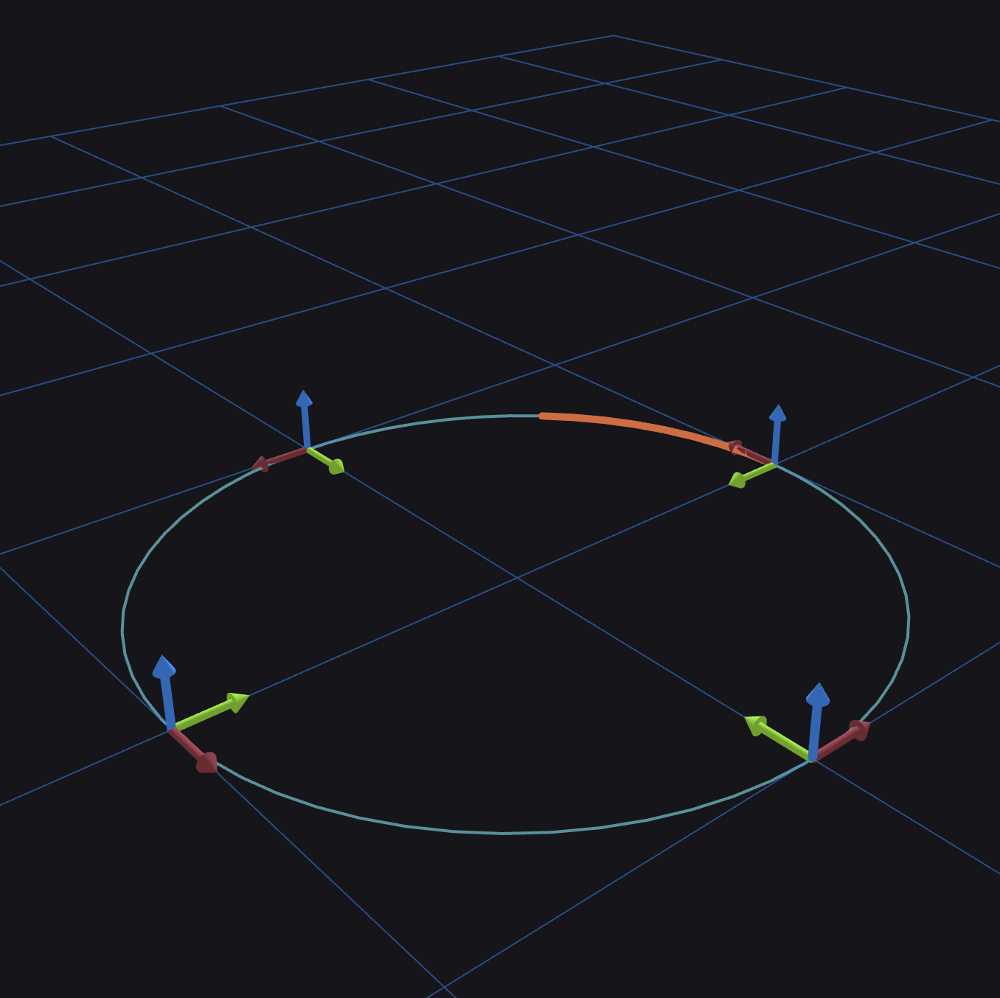

# Rigid Body State & Trajectory


Two very common tasks in robotics are:

 - Representing the position and orientation (i.e. pose) of a body along with
   its derivatives (velocity & acceleration) at a particular point in time. We
   call this a "rigid body state".

 - Representing rigid body states over a bounded period of time. In other
   words: a trajectory.

Rigid body states and trajectories can be adequately represented by the
`resim::curves::TwoJetR` and `resim::curves::TCurve` classes respectively.
However, these are low-level mathematical representations that do not provide
all the functionality we would like when reasoning about rigid body states and
trajectories. Therefore, we provide two higher-level utility classes called
`RigidBodyState` and `Trajectory`. These wrap `TwoJetR` and `TCurve`
respectively and provide that functionality. In particular, using
`RigidBodyState` objects, one can work directly with linear and angular
velocities and accelerations expressed in the body's frame without having to
reason directly about `SE3` tangent vectors. If we have a time series of
`RigidBodyState` objects representing a trajectory, we can bundle these into a
`Trajectory` object. The `Trajectory` object merely contains a `TCurve` under
the hood, so the interpolation is performed in exactly the same way (i.e. using
quintic Hermite splines). As an example of how to use these objects, lets make
a unit circle trajectory:

```
#include <Eigen/Dense>
#include <chrono>

#include "resim/actor/state/rigid_body_state.hh"
#include "resim/actor/state/trajectory.hh"
#include "resim/time/timestamp.hh"
#include "resim/transforms/se3.hh"
#include "resim/transforms/so3.hh"
#include "resim/visualization/view.hh"

// ...

using resim::transforms::SE3;
using resim::transforms::SO3;
using RigidBodyState = resim::actor::state::RigidBodyState<SE3>;
using Trajectory = resim::actor::state::Trajectory;
using Vec3 = Eigen::Vector3d;

// ...

// We will be orbiting the unit circle at a rate of one radian per second.
// Derivatives are constant along the unit circle:

// Moving forward at one unit per second
const Vec3 linear_velocity_mps = {1., 0., 0.};

// Yawing to the left at one unit per second
const Vec3 angular_velocity_radps = {0., 0., 1.};

// Importantly, the acceleration here is the derivative of the velocity
// expressed in the body's coordinate frame. Because the velocity expressed
// in the body's frame is constant in this case, the acceleration is zero.
// Because this coordinate frame is itself accelerating, the centripetal
// acceleration (i.e. mv^2 / r) *does not appear*.
const Vec3 linear_acceleration_mpss = {0., 0., 0.};
const Vec3 angular_acceleration_radpss = {0., 0., 0.};

const RigidBodyState::StateDerivatives derivatives{
    .velocity =
        {
            .linear_mps = linear_velocity_mps,
            .angular_radps = angular_velocity_radps,
        },
    .acceleration =
        {
            .linear_mpss = linear_acceleration_mpss,
            .angular_radpss = angular_acceleration_radpss,
        },
};

// We want to divide the circle into 4 segments, so we need to compute the
// amount of time it should take per second. Since we're orbiting at 1 radian
// per second, this time is just a quarter of the unit circle's circumference:
constexpr double TIME_PER_SEGMENT = M_PI_2;
constexpr resim::time::Timestamp START_TIME;
const Vec3 z_axis = {0., 0., 1.};

const Trajectory::Control control_a{
    .at_time = START_TIME,
    .state =
        RigidBodyState{SE3{SO3{M_PI_2, z_axis}, {1., 0., 0.}}, derivatives},
};
const Trajectory::Control control_b{
    .at_time = START_TIME + resim::time::as_duration(TIME_PER_SEGMENT),
    .state =
        RigidBodyState{SE3{SO3{M_PI, z_axis}, {0., 1., 0.}}, derivatives},
};
const Trajectory::Control control_c{
    .at_time = START_TIME + resim::time::as_duration(2. * TIME_PER_SEGMENT),
    .state =
        RigidBodyState{SE3{SO3{-M_PI_2, z_axis}, {-1., 0., 0.}}, derivatives},
};
const Trajectory::Control control_d{
    .at_time = START_TIME + resim::time::as_duration(3. * TIME_PER_SEGMENT),
    .state = RigidBodyState{SE3{SO3::identity(), {0., -1., 0.}}, derivatives},
};
const Trajectory::Control control_e{
    .at_time = START_TIME + resim::time::as_duration(4. * TIME_PER_SEGMENT),
    .state =
        RigidBodyState{SE3{SO3{M_PI_2, z_axis}, {1., 0., 0.}}, derivatives},
};

// Construct the trajectory
Trajectory unit_circle_trajectory{{
    control_a,
    control_b,
    control_c,
    control_d,
    control_e,
}};

// Query our unit circle and make sure we always are one unit from the origin:
const auto is_one = [](double x) {
  constexpr double TOLERANCE = 1e-12;
  return std::fabs(x - 1.) < TOLERANCE;
};
for (resim::time::Timestamp t = unit_circle_trajectory.start_time();
     t < unit_circle_trajectory.end_time();
     t += std::chrono::milliseconds(100)) {
  REASSERT(is_one(unit_circle_trajectory.point_at(t)
                      .ref_from_body()
                      .translation()
                      .norm()));
}

// Visualize the trajectory
VIEW(unit_circle_trajectory) << "My trajectory";
```

Running this code shows us our unit circle trajectory which looks like this:


