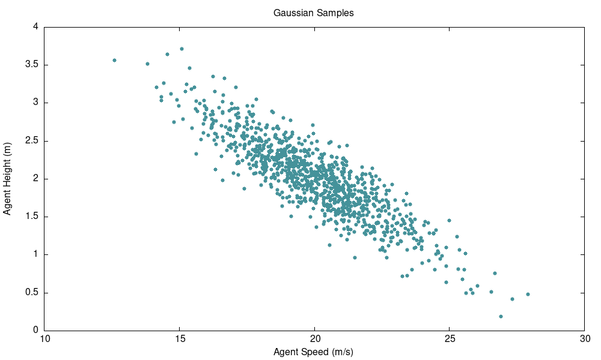

# Multivariate Gaussian

[Gaussian (i.e. normal)
distributions](https://en.wikipedia.org/wiki/Normal_distribution) are very
useful in robotics (and in engineering more broadly) because physical
quantities are quite often distributed in this way. This is because the sample
mean of a collection of independent and identically distributed (iid) random
variables is normally distributed assuming the underlying distribution has
finite variance. Gaussian assumptions underlie the frequently-used [Kalman
filter](https://en.wikipedia.org/wiki/Kalman_filter) algorithm, [optimal
control
theory](https://en.wikipedia.org/wiki/Linear%E2%80%93quadratic%E2%80%93Gaussian_control),
and many other useful mathematical tools for robotics.

Accordingly, it can be quite useful to use a Gaussian distribution when
generating plausible physical values for use in a simulation. Of course, it is
often the case that the values we might like to generate for a simulation are
not independently distributed. For example, let's say we're trying to generate
a realistic and representative road-using vehicle agent for our robot to
interact with, and we want to generate values for the agent's height as well as
a parameter representing their average speed. Intuitively we may expect that
these parameters are negatively correlated since short sports cars tend to
drive faster than tall class 8 trucks. Therefore, we shouldn't independently
sample each parameter from a scalar Gaussian distribution. If we did, we would
end up with as many fast-moving trucks as fast-moving sports cars! We instead
want to sample from a realistic joint distribution for the two quantities which
we approximate as a Gaussian with mean and covariance:

$$
\mu = \begin{bmatrix}
20 \\ 2
\end{bmatrix}\quad\quad
\Sigma = \begin{bmatrix}
4.8 & -0.96 \\ -0.96 & 0.25 \\
\end{bmatrix}
$$

To sample from this distribution, we could do the following:

```cpp
#include <fmt/core.h>

#include <Eigen/Dense>
#include <fstream>

#include "resim/math/multivariate_gaussian.hh"

// ...

using resim::math::Gaussian;
using Vec = Gaussian::Vec;
using Mat = Gaussian::Mat;

// Set up our Gaussian sampler
Vec mean = Vec::Zero(2);
mean << 20., 2.;

Mat covariance = Mat::Zero(2, 2);
covariance << 4.8, -0.96, -0.96, 0.25;

Gaussian gaussian{mean, covariance};

// Sample the distribution:
Gaussian::SamplesMat samples = gaussian.samples(1000);

// Write our data out
std::ofstream output;
output.open("gaussian_samples.csv");
for (const auto &sample : samples.rowwise()) {
  output << fmt::format("{0}, {1}", sample.x(), sample.y()) << std::endl;
}
output.close();
```

Which gives the following samples:


As you can see, we've produced a qualitatively reasonable set of values where
agents with smaller heights tend to have a higher average speed. We could now
use these to generate a set of simulation scenarios with agents like this. In
reality we would likely want to use sample means and covariances based on real
world data rather than making up a qualitatively nice mean and covariance like
we did for this example, but hopefully this gives a taste of how this library
can be used in production code.

!!! Note
    Feel free to play around with the [source
    code](https://github.com/resim-ai/open-core/blob/main/resim/examples/gaussian.cc)
    for the example above.
