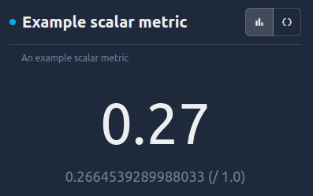
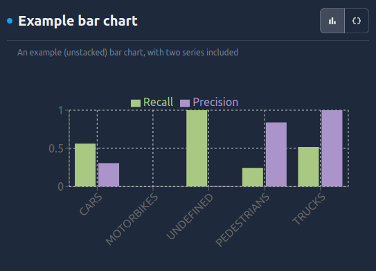
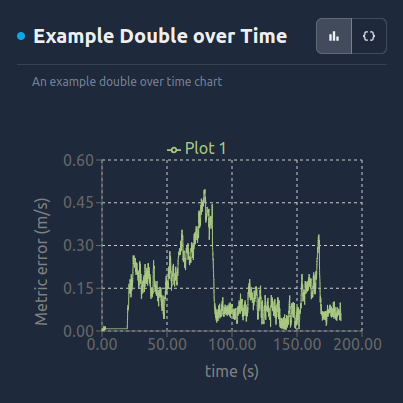
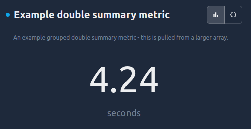
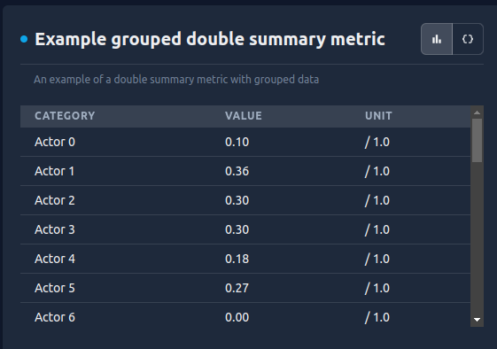
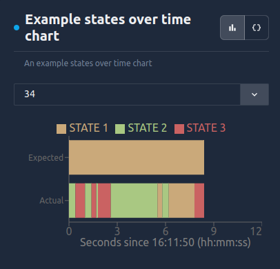
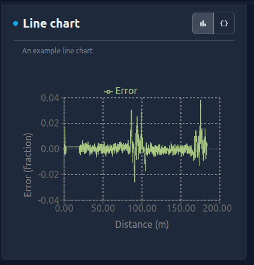
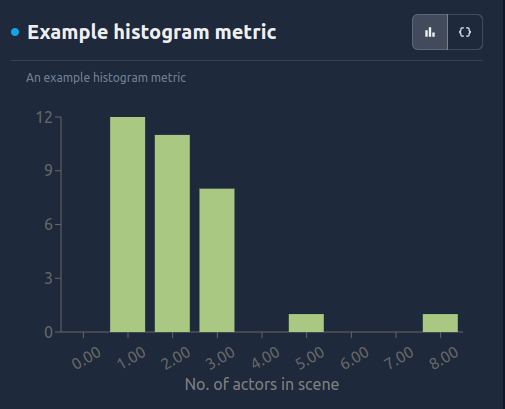

# Metric Types

There are several types of metrics, and it's really important to know what data types the different types of metrics can accept. This doc summarizes the different metrics, and the data types they take.

## All Metrics

All metrics take a certain set of shared parameters, which are relevant to all metrics.

### Shared Parameters

- `name: str` - A required, immutable name. The same name cannot be used twice, so they are uniquely identifying.
- `description: str` - A string description of the metric.
- `status: MetricStatus` - An overall status (e.g. PASSED, FAILED). Note that by default this is *not* computed using any metrics failure definitions provided, it should be computed by the user.
- `importance: MetricImportance` - An overall importance (e.g. CRITICAL, HIGH, LOW, ZERO).
- `should_display: bool` - A bool representing whether this should be displayed in the UI.
- `blocking: bool` - A bool representing whether this metric failing should block the overall metrics run from passing. NB: This will likely be deprecated shortly.
- `order: float` - A float representing the order in which this metric should be displayed within the context of any analysis pages on the ReSim app. If explicitly set (even as 0), the implied order semantics are via '<' and alphabetically if '=='. If not explicitly set, it is assumed to be greater than MAX_FLOAT and, therefore, ordered after any set fields.
- `tags: List[Tag]` - A list of key/value tags to attach to the metric. These will show up in the ReSim app when viewing metrics. e.g. `tags=[Tag("key", "value")]`

### Grouped data support

> Some metrics support "grouped data" [as described in the metrics data docs](./metrics_data.md#grouping-metrics-data), and some do not yet support this. Please check below to see whether it is supported, before attaching grouped data to a metric!

## Scalar Metric

This is a maximally simple metric, with a single double. This is one of only two metrics that do not have any `MetricsData` associated, and is intended to be used for easy top-line metrics. An example would be distance traveled by a robot.

> Our roadmap includes support for scalar metrics being visualized over time on the same experience, and easily averaged and compared across multiple runs and batches, so use ScalarMetric for top-line metrics you want to see improve over time!



### Parameters

- `value: float` - the metric's numerical value.
- `failure_definition: DoubleFailureDefinition` - the thresholds (on `value`) for whether the metric fails.
- `unit: str` - a unit associated with `value`.

## Bar Chart

Bar chart provides a stacked or side-by-side bar chart of numerical data. An example would be the precision and recall being plotted as bars, over several different detection categories.



### Parameters

- `values_data: List[MetricsData]` - A list of $k$ series of doubles, each indexed by the same series of strings. These are the values to plot, and every series will be plotted on the same bar chart. The index values are the labels on the x-axis.
- `statuses_data: List[MetricsData]` - A list of $k$ series of MetricStatuses, each indexed by the same series of strings. These are statuses associated with the above values.
- `legend_series_names: List[str]` - A list of $k$ names, which are the legend names associated to each bar chart.
- `x_axis_name: str`
- `y_axis_name: str`
- `stack_bars: bool` - A bool indicating whether to stack the $k$ series. If this is true, a stacked bar chart will be produced, with all the series stacked above the corresponding index. If this is false, the $k$ bars per-index will be placed next to each other, above the corresponding index.

### Grouped data support

Grouped data should not currently be supplied to bar chart metrics.

## Double over time

This is a plot of doubles, across timestamps in the simulation/experience. An example would be the distance between a self-driving car and the car in front, over a 30 second experience.



### Parameters

- `doubles_over_time_data: List[MetricsData]` - A list of $k$ MetricsData containing series of doubles, indexed by series of timestamps. Each such series will be plotted as a separate line on the same chart.
- `statuses_over_time_data: List[MetricsData]` - A list of $k$ MetricsData containing series of statuses, indexed by the same timestamps.
- `failure_definitions: List[DoubleFailureDefinition]` - An optional list of $k$ failure thresholds, corresponding to the $k$ series of doubles.
- `start_time: Timestamp` - An optional start time, if it differs from the minimum element in the $k$ series.
- `end_time: Timestamp` - An optional end time, if it differs from the maximum element in the $k$ series.
- `y_axis_name: str`
- `legend_series_names: List[str]`: An optional list of $k$ names for the data series - if not provided, the MetricsData names will be used.

### Grouped Data Support

Grouped data should not currently be supplied to double over time metrics.

## Double Summary 

This is a single double summarizing a larger series of data. Currently, it only supports indexing an element from a series - in the future, we will likely add simple operations such as max, min, mean, and median.



### Parameters

- `value_data: MetricsData` - A series of doubles, optionally indexed.
- `status_data: MetricStatus` - A series of statuses, corresponding to `value_data`.
- `index_data: Union[int, str, Timestamp, uuid.UUID]` - An optional index $i$, with type corresponding to the index type of `value_data` (or `int` if there is no index). If not provided, then 0 will be used. This "selects" the element with corresponding index from value_data.
- `failure_definition`: A failure definition for the selected value.

### Grouped data

- Grouped data can be provided, and will be plotted as a key-value table, with key being the group name, and value being the corresponding double.



## States over Time

States-over-time charts visualize a categorical enum which changes over time. An example would be the classifications for an object's type, plotted over time; or a vehicle's attempted maneuver over time.



### Parameters 

- `states_over_time_data: List[MetricsData]`: A list of $k$ series, of strings, each indexed by timestamps. The strings here are used as an enum representing "states the system can be in", which are then plotted over time. If more than one series is provided, they will be plotted next to each other in one plot.
- `statuses_over_time_data: List[MetricsData]`: A list of $k$ series of statuses, each indexed by timestamps. These are the timestamp-level statuses associated with `states_over_time_data`.
- `states_set: Set[str]` - A set of all possible states. This is useful when a state exists, but does not appear in the data.
- `failure_states: Set[str]` - A subset of `states_set`, representing the states in which it should fail.
- `legend_series_names: List[str]` - A list of $k$ strings, storing the legend names of the series in `states_over_time_data`.


### Grouped data support

Grouped data is supported for StatesOverTime metrics, and will give a dropdown, with one chart per category.

## Line Chart

Line charts are classical line charts, plotting a dependent variable against an independent variable, joined by a line. Multiple lines can be placed on one chart.

> Our roadmap includes adding scatter plots under this plot type also.



### Parameters

- `x_doubles_data: List[MetricsData]` - A list of $k$ series of x-axis values to plot, which are doubles. Each series will be plotted on the same chart.
- `y_doubles_data: List[MetricsData]` - A list of $k$ series of y-axis values, where the $i$^{th} series corresponds to the $i$^{th} series in `x_doubles_data`.
- `statuses_data: List[MetricsData]` - A list of $k$ series of statuses, each corresponding to the corresponding (pair of) values in `x_doubles_data` and `y_doubles_data`
- `x_axis_name: str`
- `y_axis_name: str`
- `legend_series_names` - A list of $k$ strings, storing the legend names of the series in `x_doubles_data` and `y_doubles_data`.

### Grouped data support

Grouped data should currently not be provided to line plot.

## Histogram

Histograms plot the frequencies with which doubles appear in an array, by bucketing them and plotting them as a bar chart. An example would be the frequencies over frames of the probabilities output by a classifier; or the frequencies with which there are a certain number of actors detected.



### Parameters

- `values_data: MetricsData`: A series of doubles, the frequencies of which will be plotted.
- `statuses_data: MetricsData`: The associated statuses to `values_data`.
- `buckets: List[HistogramBucket]`: A list of the buckets to use for the histogram plot - e.g `[[0, 1), [1, 2), [2, 3)]` would plot of how many of the doubles appear in each integer interval between 0 and 3.
- `lower_bound`: An optional lower bound on how small values can be.
- `upper_bound`: An optional upper bound on how big values can be.

### Grouped data support

Grouped data should not currently be provided to histogram metrics.

## Plotly Metric

In the event that the above metric types are not sufficient, ReSim support displaying an arbitrary plotly chart, via serializing 
the [plotly JSON model](https://plotly.com/chart-studio-help/json-chart-schema/). This is the second metric to not have any `MetricsData`
associated. It takes advantage of the ability to serialize a plotly figure as a JSON string:

```python
figure = px.pie(
    data_frame=<data_frame>,
    values=<values>,
    names=<name>,
    title=f"Pie chart example",
    template=<template>,
)
plotly_json = figure.to_json()
```

In this way, charts not yet supported natively can be displayed and have the rest of the metrics framework metadata e.g. importance, status associated.

### Parameters

- `plotly_data: str` - the metric's plotly chart.

## Image Metric

The ReSim metrics framework also supports attaching an arbitrary image as a metric. This could be used to attach images from sensors, or from extremely custom charts previously created. This is simply achieved by storing the image in the `/tmp/resim/outputs` directory and referencing the filename in the metric.


### Parameters

- `image_data: ExternalFileMetricsData` - the metric's image, as an external file metrics data, which simply encapsulates the path to the file.

## Image List Metric

For situations where you wish to attach a list of images to a single metrics, the ReSim metrics framework also supports an `ImageListMetric`. This is simply achieved by storing the images in the `/tmp/resim/outputs` directory and referencing the filenames in the metric.


### Parameters

- `image_list_data: List[ExternalFileMetricsData]` - the metric's images, as a list of external file metrics data, which simply encapsulates the path to each file.
