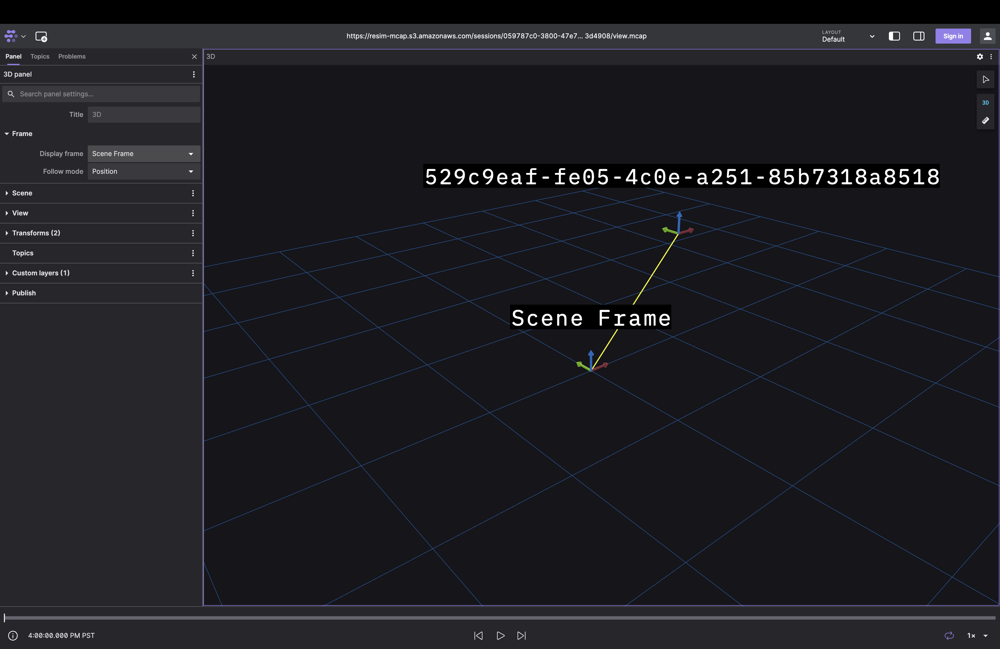
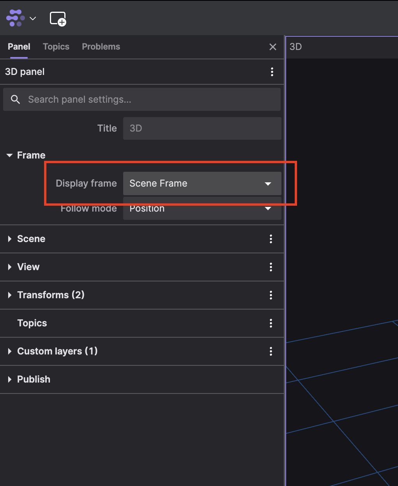
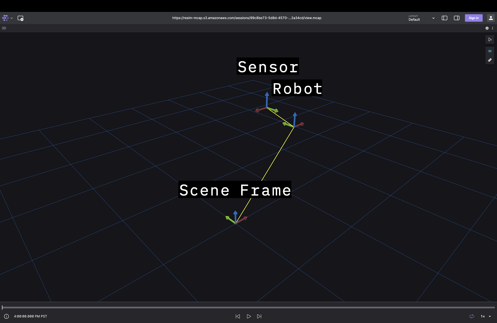

# ReSim View

Visualization is a critical accelerator for robotics development. When
developing and debugging robotics code there is simply no substitute for a good
picture of what is going on in 3D space. Objects like vectors, transforms,
geometries, and curves are very difficult to reason about up until the moment
they are visualized. Then, the human brain can bring to bear its innate
abilities to reason about 3D space and gain insights much more quickly and
correctly. It is for this reason that visualization is of prime importance to
our mission.

The main visualization tool at the code level is ReSim View. In a single
phrase, this tool is "print statements for 3D objects". In the same way that a
print or log statement can help one reason about the behavior of non-robotics
code, a View statement allows users a quick and lightweight way to see their
3D objects. Here's how it works:

First, a user adds a `VIEW()` statement to their code, enclosing one of a set
of supported types. The types currently include:

  1. Named coordinate frames (`Frame`).
  2. 3D rotations (`SO3`).
  2. 3D poses (`SE3`).
  3. Arc length parameterized curves (`DCurve`).
  4. Time parameterized curves (`TCurve` and `Trajectory`).
  5. Vectors in a coordinate frame (`FramedVector`).

It's also possible to assign a name to each object being viewed which can make
it much easier when viewing many different objects at once. This is done with
the `<<` operator to pipe a name into the view statment. Here's an example of
how one might visualize a transform with named coordinate frames:

```
#include "resim/transforms/frame.hh"
#include "resim/transforms/se3.hh"
#include "resim/transforms/so3.hh"
#include "resim/visualization/view.hh"

// ...

using resim::transforms::SE3;
using resim::transforms::SO3;
using Frame = resim::transforms::Frame<SE3::DIMS /* 3 */>;

// Generate new frames with unique ids:
const Frame scene = Frame::new_frame();
const Frame robot = Frame::new_frame();

const SE3 scene_from_robot{
    SO3::identity(),  // Rotation
    {1., 0., 1.},     // Translation
    scene,            // Destination/Into Frame
    robot             // Source/From Frame
};

// We're using the << operator to add a name to our frame. If we don't use
// it, the frame id is used instead.
VIEW(scene) << "Scene Frame";
VIEW(robot);
VIEW(scene_from_robot) << "My Transform";
```

When this statement is executed at run time, it will prompt the user to authenticate (if they have not previously):

```
Authenticate at the following URL: https://resim.us.auth0.com/activate?user_code=XXXX-XXXX
```

And once authenticated the user will be given a link which they can follow to
observe their visualization in Foxglove Studio.

```
View your data visualization in the ReSim App: http://app.resim.ai/view?bucket=resim-mcap&path=sessions/059787c0-3800-47e7-b95b-9d2e593d4908/view.mcap
```

Following this link opens Foxglove Studio in your browser with the visualization:




If you don't initially see anything, you may have to enter the 3D panel
settings and set its display frame to one of the frames in your scene (e.g.
"Scene Frame" for this example):

{: width="50%"; .center }


Foxglove Studio will automatically build a scene graph for you from
the frames you provide. Consider the following example:

```
#include "resim/transforms/frame.hh"
#include "resim/transforms/se3.hh"
#include "resim/transforms/so3.hh"
#include "resim/visualization/view.hh"

// ...

using resim::transforms::SE3;
using resim::transforms::SO3;
using Frame = resim::transforms::Frame<SE3::DIMS /* 3 */>;

// Generate new frames with unique ids:
const Frame scene = Frame::new_frame();
const Frame robot = Frame::new_frame();
const Frame sensor = Frame::new_frame();

const SE3 scene_from_robot{
    SO3::identity(),  // Rotation
    {1., 0., 1.},     // Translation
    scene,            // Destination/Into Frame
    robot             // Source/From Frame
};

const SE3 robot_from_sensor{
    SO3(M_PI, {0., 0., 1}),  // Rotation
    {-0.25, 0.25, 0.25},     // Translation
    robot,                   // Destination/Into Frame
    sensor                   // Source/From Frame
};

// We're using the << operator to add a name to our frame. If we don't use
// it, the id is used instead.
VIEW(scene) << "Scene Frame";
VIEW(robot) << "Robot";
VIEW(scene_from_robot) << "Scene from Robot";

VIEW(sensor) << "Sensor";
VIEW(robot_from_sensor) << "Robot from Sensor";
```



<!-- 
TODO(https://app.asana.com/0/1204498029712344/1204836701207673/f) Add
documentation to describe how to inspect views in the app once we're ready to
make this capability public.
-->

As mentioned above, ReSim View is capable of visualizing many more data types.
Rather than go through these in detail here, we refer the reader to the
examples in `resim/visualization/examples/` to explore and play around with the
full capabilities of the tool. Don't forget to play around with the "play"
button in Foxglove Studio when working with the time parameterized `TCurve` or
`Trajectory` objects!

!!! Note
    Feel free to play around with the [source
    code](https://github.com/resim-ai/open-core/blob/main/resim/examples/view.cc)
    for the examples above.
